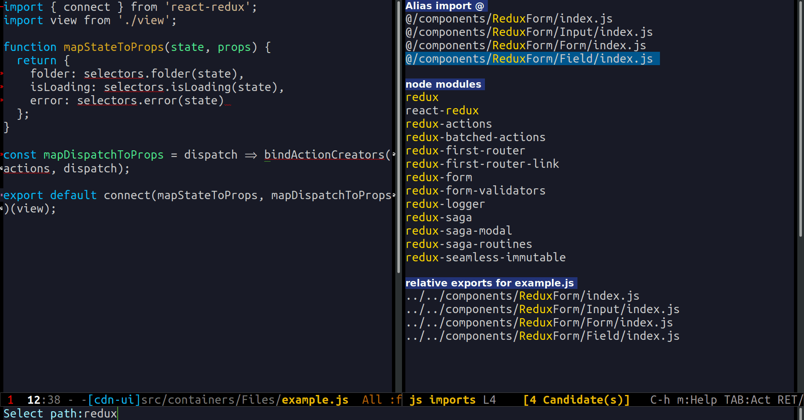

# js-import

An Emacs plugin for importing JavaScript and TypeScript files with [helm](https://github.com/emacs-helm/helm "helm") interface.



A package proposes to select a file or dependency of the current project, reads its exports statements and inserts an import statement with selected candidates into a buffer.

## Requirements

- Emacs 24.4 or higher
- Helm 3.0 or higher
- [Projectile](https://github.com/bbatsov/projectile "projectile")
- [Quelpa](https://github.com/quelpa/quelpa "quelpa") - while package is under develop and is not available on Melpa

## Installation

Until `js-import` is not published on Melpa you can install the package from [quelpa](https://github.com/quelpa/quelpa "quelpa").


```cl
(quelpa '(js-import
          :repo "KarimAziev/js-import"
          :fetcher git
          :url "git@github.com:KarimAziev/js-import.git"))
```


Or if you want to always get the latest version:

```cl
(quelpa '(js-import
          :repo "KarimAziev/js-import"
          :fetcher git
          :url "git@github.com:KarimAziev/js-import.git")
        :upgrade t)
```

## Usage

Main commands are `js-import-helm`, `js-import-alias`, `js-import-relative` and `js-import-dependency`. All of them have the same flow:

1. Propose you to select a file
2. Propose you to choose export declarations (to select some declaration you need to mark them) from this file which you want to import.
3. With default action, those declarations will be added to the current buffer. You can also import them as by another name with action `Import as`.

` M-x js-import-helm ` proposes you to select js module from all available sources: dependencies and files from the current project with relative or alias path.

` M-x js-import-relative ` proposes you to select js module by relative path

` M-x js-import-dependency ` proposes you to select js module from dependencies specified in the `package.json`.

` M-x js-import-alias ` proposes you to select js module with alias path. You can specify aliases in variable `js-import-alias-map` or adding it to your root project  `.dir-locals.el` file.

Suppose your webpack config includes two aliases `@` and `UI`:


```javascript
module.exports = {
  //...
  resolve: {
    alias: {
      @: path.resolve(__dirname, 'src'),
      UI: path.resolve(__dirname, 'src/components/UI')
    }
  }
};
```

In this case you need to add then also in your `.dir-locals.el` in that way:

```cl
((nil . ((js-import-alias-map "@" "src" "UI" "components")
         )))
```

You can also edit current imports with command:

` M-x js-import-edit-buffer-imports `
